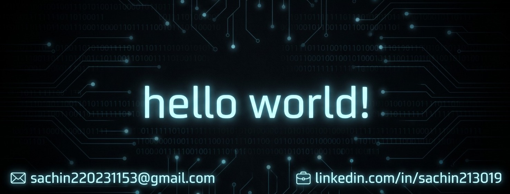

<!--Banner with Training Photo, Name, Mail & Portfolio -->

  

  <h1>🤖 ɪ'ᴍ sᴀᴄʜɪɴ!</h1>
  
<b>Robotics Trainer & Full-Stack Developer</b>

  

    ✉️ <a href="mailto:sachin220231153@gmail.com">sachin220231153@gmail.com</a> &nbsp;|&nbsp; 
    🌐 <a href="https://sachin1399.github.io/portfolio/">Visit My Portfolio</a>
  

---

<!--Night Owl image-->

  

<!--Start Intro-->                         

I am a Robotics Trainer and Full-Stack Developer with a huge passion for Python, JavaScript, Arduino C++, RDBMS, and Hardware Integration. 

- 🌱 Student of life :)
- 💡 I’m currently learning many things, I believe that everyday is a learning opportunity.
- 🤖 Robotics Trainer at [The Smart Mind AI Lab](https://sachin1399.github.io/portfolio/) in Mumbai, guiding students through advanced automation projects like the **Hexa City / Smart City model**.
- 🚀 Writing technical code and bridging the gap between software and hardware.
- 💻 Visit my [Portfolio](https://sachin1399.github.io/portfolio/) for more details about me.
- ✉️ Reach me out at [sachin220231153@gmail.com](mailto:sachin220231153@gmail.com).
<!--End Intro-->

<!--Profile Count Badge-->

  

---

<!--Languages and Tools Section-->       
<h2 align="center">Tᴇᴄʜ sᴛᴀᴄᴋ & Cᴜʀʀᴇɴᴛ Lᴇᴀʀɴɪɴɢ</h2> 
<picture>
  <source media="(prefers-color-scheme: dark)" srcset="https://raw.githubusercontent.com/Kiran1689/Kiran1689/main/Skills_Animation_Dark.gif">
  <source media="(prefers-color-scheme: light)" srcset="https://raw.githubusercontent.com/Kiran1689/Kiran1689/main/Skills_Animation_White.gif">
  
</picture>
 

<h3 align="left">Current Learning</h3>
<ul align="left">
  <li>Deepening my knowledge in Artificial Intelligence and Machine Learning (AI & ML).</li>
  <li>Exploring advanced C++ programming and sensor architectures for Arduino and ESP microcontrollers.</li>
  <li>Improving my skills in full-stack web architectures and cloud-based deployments.</li>
</ul>
  
<h3 align="left">HackerRank Badges & Achievements</h3>

  
  
  
  
  
  

 
 
 
 

<!--Professional Experience Section-->
<h2 align="center">💼 Pʀᴏғᴇssɪᴏɴᴀʟ Cʜʀᴏɴɪᴄʟᴇs (Exᴘᴇʀɪᴇɴᴄᴇ)</h2>
<ul>
  <li><b>The Smart Mind AI Lab</b> (Robotics Trainer | June 7, 2026 – Present | Mumbai): Directing hands-on training sessions on core robotics concepts, sensor integration, and C++ programming for Arduino/ESP projects. Guiding advanced automation layouts like the Hexa City / Smart City model.</li>
  <li><b>Tech Bharat Innovation</b> (Robotic Training Expert Intern | April 2026 – June 2026 | Gujarat): Delivered practical guidance on robotics components and microcontrollers for 100+ daily trainees across concurrent batches.</li>
  <li><b>Q-Spiders</b> (Full-Stack Web Development Intern | Sep 2025 – Dec 2025 | Noida): Completed an intensive program emphasizing advanced front-end architectures and backend integration.</li>
  <li><b>CodSoft</b> (Python Programming Intern | July 2025 – Aug 2025 | Virtual): Built CRUD To-Do List applications and secure password generators.</li>
</ul>
 

<!--Field Operations & Live Training with Students Photo-->
<h2 align="center">📸 Fɪᴇʟᴅ Oᴘᴇʀᴀᴛɪᴏɴs & Lɪᴠᴇ Tʀᴀɪɴɪɴɢ</h2>

  

  <em>Guiding students and children hands-on with real-world robotics and interactive hardware modules.</em>

 

<!--Featured Hardware & System Projects-->
<h2 align="center">🏙️ Fᴇᴀᴛᴜʀᴇᴅ Hᴀʀᴅᴡᴀʀᴇ & Sʏsᴛᴇᴍ Pʀᴏᴊᴇᴄᴛs</h2>
<table width="100%">
  <tr>
    <td width="33%"><strong>🌆 Hexa City (Smart City)</strong> Arduino UNO, ESP8266, Sensors, LDR, Servos. Automated smart parking, traffic lights, and toll plaza.</td>
    <td width="33%"><strong>🎙️ Speak Engine</strong> Python, SpeechRecognition, OpenAI, gTTS. AI-powered voice assistant for task automation.</td>
    <td width="33%"><strong>🃏 CodeComic</strong> Python, Pyjokes, AI, VS Code. Interactive desktop app for programming jokes.</td>
  </tr>
</table>
 

<!--Certifications Section-->
<h2 align="center">📜 Cᴇʀᴛɪғɪᴄᴀᴛɪᴏɴs & Aᴄᴀᴅᴇᴍɪᴄs</h2>
<ul align="left">
  <li>🎓 <b>Python for Data Science (Elite)</b> – IIT Madras / MoE Govt. of India (Jan 2026 – Feb 2026)</li>
  <li>🐍 <b>Python (Basic)</b> – HackerRank Verified [ID: 5D1AC2FA43A3] (16 Apr, 2025)</li>
  <li>🗄️ <b>SQL (Basic)</b> – HackerRank Verified [ID: 5F66B61ECA14] (16 Apr, 2025)</li>
  <li>⚡ <b>Hackathon Participant</b> – Team Hustle Coder in Adobe Hackathon (Aug 2025)</li>
  <li>🎓 <b>B.Tech in Computer Science & Engineering (AI & ML)</b> – AKTU, Lucknow (2022–2026)</li>
</ul>
 

<!--Trophies Section (Cleaned up - Question marks removed)-->    
<h2 align="center">🏆 Gɪᴛʜᴜʙ Tʀᴏᴘʜɪᴇs 🏆</h2>

  <a href="https://github.com/sachin1399">
    <picture>
      <source media="(prefers-color-scheme: dark)" srcset="https://github-profile-trophy-ruddy.vercel.app/?username=sachin1399&no-bg=true&row=1&column=3&margin-w=20&margin-h=20&theme=monokai">
      <source media="(prefers-color-scheme: light)" srcset="https://github-profile-trophy-ruddy.vercel.app/?username=sachin1399&no-bg=true&row=1&column=3&margin-w=20&margin-h=20">
      
    </picture>
  </a>

 

<!--Github stats Table--> 
<h2 align="center">📊 Gɪᴛʜᴜʙ Sᴛᴀᴛs 📊</h2>

<table width="100%">
  <tr>
    <td width="50%">
      <h3 align="center"><strong>Gɪᴛʜᴜʙ Sᴛᴀᴛs</strong></h3>
      

        
      

    </td>
    <td width="50%">
      <h3 align="center"><strong>Sᴛʀᴇᴀᴋ Sᴛᴀᴛs</strong></h3>
      

        
      

    </td>
  </tr>
  <tr>
    <td width="50%">
      <h3 align="center"><strong>Lᴀᴛᴇsᴛ Pʀᴏᴊᴇᴄᴛ</strong></h3>
      

        
      

    </td>
    <td width="50%">
      <h3 align="center"><strong>Tᴏᴘ Cᴏɴᴛʀɪʙᴜᴛɪᴏns</strong></h3>
      

        
      

    </td>
  </tr>
</table>
 

<!--Contribution Graph-->
<h2 align="center">📈 Cᴏɴᴛʀɪʙᴜᴛɪᴏɴ Gʀᴀᴘʜ 📈</h2>

    

---

<!--Thought of the day--> 
<h2 align="center">🌟 Tʜᴏᴜɢʜᴛ ᴏғ ᴛʜᴇ Dᴀʏ 🌟</h2>

    

 

<!--Contact Section--> 
<h2 align="center">🤝 Cᴏɴɴᴇᴄᴛ Wɪᴛʜ Mᴇ 🤝 </h2>

  

 

<!--Footer--> 

  

